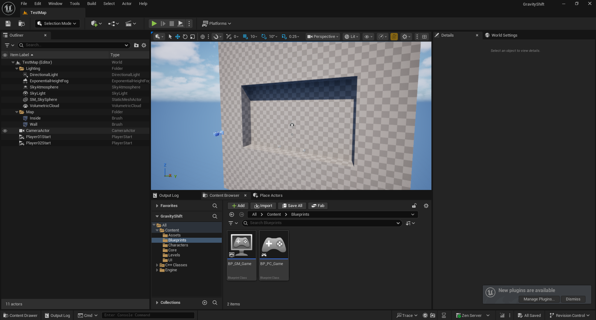

# Development-GravityShift

## Preview

---

## Introduction

> Unreal 엔진을 사용해 3D 기반의 2D 플랫폼 퍼즐 게임을 만들어 보자.

---

## 기술 및 학습 내용

| 구분 | 내용 |
|------|------|
| ?? | ?? |

---

## 개선 아이디어

- ??

---

## Requirements

> 프로젝트 실행 환경 및 버전 정보

| 항목 | 내용 |
|------|------|
| OS | Windows 11 |
| Engine | Unreal v 5.6.1 |
| Language | Cpp |

---

## Summary

??
